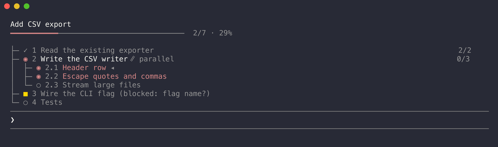

# Todo List for Claude Code

`claude-mod-todo-list` is a Claude Code mod. Claude writes a plan tree for every task through the plugin's tool, `mcp__todo-list__plan`; a pane and the status line show progress and what Claude is doing right now; state-changing tools wait until a plan exists.



## Features

- **Plan tree tool.** Every prompt that leads to tool use gets a tree, written through `mcp__todo-list__plan`. It nests 3 levels and supports parallel groups.
- **Live pane and status line.** Both draw the tree with per-node status and a progress bar.
- **Live activity.** What Claude is doing comes from session events, not from Claude's own report.
- **Plan-first enforcement.** Edit, Write, Bash and other state-changing tools are denied until a plan exists. It fails open.
- **`/todo` commands and accent colour.** Reopen the pane, clear the plan, switch enforcement, set the accent colour (Claude orange by default, saved across sessions).

## Install

Install from GitHub:

```
claude plugin marketplace add 0xnicholasy/claude-mod-todo-list
claude plugin install todo-list@claude-mod-todo-list
```

Set options at install with `--config`, for example `--config accentColor=#c084fc` or `--config enforce=false`. Add `-s project` to install for one project only. Scope values are `user`, `project` and `local`; the default is `user`.

If you also run the mod from a checkout, the installed plugin takes precedence over a local copy with the same name `todo-list`, so uninstall it while developing.

Update (restart required):

```
claude plugin marketplace update claude-mod-todo-list
claude plugin update todo-list@claude-mod-todo-list
```

Uninstall with `claude plugin uninstall todo-list@claude-mod-todo-list`. Check what is installed with `claude plugin list`.

## Run from a checkout

Clone the repo:

```
git clone https://github.com/0xnicholasy/claude-mod-todo-list.git
cd claude-mod-todo-list
```

Then run:

```
claude --plugin-dir .claude/skills/todo-list
```

Run it from the repo root, or pass the absolute path to `.claude/skills/todo-list`. If `/todo` is not offered, run `claude plugin list` to check that the plugin is loaded and enabled.

## What the pane shows

```
Add CSV export
━━━━━━━━━━━─────────────────────────────  2/7 · 29%
◉ Running Bash · 1 subagent

├─ ✓ 1 Read the existing exporter                    2/2
├─ ◉ 2 Write the CSV writer ∥ parallel               0/3
│  ├─ ◉ 2.1 Header row ◂
│  ├─ ◉ 2.2 Escape quotes and commas
│  └─ ○ 2.3 Stream large files
├─ ■ 3 Wire the CLI flag (blocked: flag name?)
└─ ○ 4 Tests
```

The first line is the plan title and the second is a progress bar with leaves done out of total leaves. Then comes the live activity, and the rest is the tree, with each node's id. Parent rows show their done/total count at the right edge of the pane. The current step is marked with `◂`. A parallel group shows `∥ parallel` after its title, and every running step in it has the accent colour and a bold title, but only the first carries `◂`. When the tree is too tall, the paths to all running steps stay visible and the rest is summarised as `+N more`.

The pane opens at session start on an interactive terminal 110 columns or wider; on a narrower one the host holds an unasked pane undrawn, so it opens on your first prompt instead (once per session, so a pane you close stays closed). `/todo` reopens it. The status line shows a short form, for example `Plan 3/7 · Escaping quotes and commas · Running Bash`, and `Plan 2/7 · Header row +1 more running` while several steps run at once.

The accent colour (current step, running steps, progress bar) is Claude orange by default (the `claude` theme key, which follows light and dark themes). `/todo color <name|#hex>` changes it and the choice is saved, so it applies to every session until `/todo color reset`. The `accentColor` option sets the default used when nothing is saved (a theme key or colour such as `magenta` or `#c084fc`); an invalid value falls back to Claude orange:

```
claude --plugin-dir .claude/skills/todo-list \
  --settings '{"pluginConfigs":{"todo-list":{"options":{"accentColor":"#c084fc"}}}}'
```

`/todo color <name|#hex|reset>` overrides it and is saved across sessions.

## Layout

Claude Code chooses where the pane goes, and a plugin cannot force it. The pane docks beside the transcript only in the fullscreen layout, from 110 columns. The main screen always shows it inline above the prompt; the plugin's own type declarations describe the main screen as "`CLAUDE_CODE_NO_FLICKER=0`, tmux by default". To get the fullscreen layout, set `CLAUDE_CODE_NO_FLICKER=1` (inferred from that note; the declarations name only the `=0` value). Under tmux, or on the main screen, expect the inline pane.

The pane asks for 56 columns when docked, and for as many rows as the tree needs (6 to 20) when inline. These are requests: a size you dragged wins. When the pane is inline on a wide terminal, `/todo` adds a tip about the fullscreen layout. The tree always fits the pane's body: if it is too tall, the path to every running step stays visible and the rest becomes `+N more`.

Below 50 columns the pane compacts: a shorter bar, `done/total` with no percentage, the count placed after a parent's title instead of at the right edge, a bare `∥` for a parallel group, notes cut to 20 characters, and no subagent count on the activity line when it would not fit.

## Node status

| Glyph | Status | Meaning |
|---|---|---|
| `✓` | Completed | The step is done. |
| `◉` | In progress | The step is running. Claude keeps one leaf in progress at a time. |
| `○` | Pending | Not started. |
| `■` | Blocked | The step cannot proceed; the note says why. |
| `–` | Skipped | The step was dropped; the note says why. |

A parent takes its status from its children. Any child in progress makes the parent in progress. Otherwise any blocked child makes it blocked. If every child is completed or skipped, the parent is completed. If some are done and the rest are pending, it is in progress. Otherwise it is pending. Only leaves are set by hand through the tool.

## Activity

Activity comes from session events, not from Claude's own report.

| Label | When |
|---|---|
| Working | A prompt was submitted and Claude is thinking. |
| Running <tool> | A tool call from the main session is running. |
| Waiting for permission: <tool> | A tool call is waiting on a permission dialog. |
| Waiting for your answer | Claude asked a question with AskUserQuestion. |
| Compacting | The conversation is being compacted. |
| N subagents | Appended to any label while N subagents run. |
| Interrupted | The turn was aborted, for example with Esc. |
| Error | The turn ended in an error or a refusal. |
| (none) | The turn ended with an answer. The activity line is left out, and the status line shows only the plan part. |

## The plan tool

`mcp__todo-list__plan` takes an `op` field.

| Op | Input | Effect |
|---|---|---|
| `set` | `title`, `nodes` | Replaces the plan. Nodes nest up to 3 levels, 60 nodes in total. |
| `add` | `parent?`, `nodes` | Appends children under a node, or at the top level when `parent` is absent. |
| `update` | `updates` of `{ id, status?, title?, note? }` | Batch patch. Status applies to leaves only. |
| `remove` | `id` | Drops a node and its subtree. Ids are never reused. |
| `show` | none | Returns the current tree with ids. |

A node may set `parallel: true` (on `set` or `add`). Its children may then be `in_progress` at the same time; anywhere else, only one step may run, and a second `in_progress` leaf is rejected with an error naming the shared parent. A parallel group is shown with an `∥ parallel` tag.

Every answer is the plain-text tree. A failure is a result that starts with `Error:`. The current plan is also attached to each new prompt, so ids stay in sync after a compaction. `/clear` resets the plan.

## Enforcement

Until the current task has a plan, these main-session tools are denied: Edit, Write, NotebookEdit, Bash, Agent, Workflow, CronCreate, CronDelete, EnterWorktree, ExitWorktree and RemoteTrigger. The denial tells Claude the exact `set` call to make.

These are never blocked: the plan tool, read-only tools (Read, Grep, Glob, LSP, WebFetch, WebSearch, ToolSearch, TaskGet, ListMcpResourcesTool, ReadMcpResourceTool, Skill), AskUserQuestion, and any call made inside a subagent. A prompt that only reads files or answers a question is never blocked.

A task starts at each typed prompt. A background-agent completion (`<task-notification>`) continues the current task. A task counts as planned when the plan has unfinished nodes, or after any successful plan tool call or mirrored task call.

Three ways to turn enforcement off:

- `userConfig.enforce` (default `true`). Set it in settings, or per run with `--settings`:

  ```
  claude --plugin-dir .claude/skills/todo-list \
    --settings '{"pluginConfigs":{"todo-list":{"options":{"enforce":false}}}}'
  ```

- `/todo off` turns it off for the session. `/todo on` turns it back on.
- Automatic pause: after 3 denies in one turn with no plan call, the gate stops denying for the rest of that turn and shows a toast.

Enforcement fails open. It also allows every call when the plan tool did not register, when the plan tool was not offered to the model, and when any error is thrown inside the gate.

## Commands

- `/todo`: reopen the pane.
- `/todo clear`: empty the plan.
- `/todo off`: turn enforcement off for this session.
- `/todo on`: turn enforcement back on.
- `/todo color <name|#hex|reset>`: set the accent colour, saved for every session until you reset it; `reset` goes back to the `accentColor` option (Claude orange by default).

## TaskCreate and TaskUpdate mirroring

When the session offers `TaskCreate`, `TaskUpdate` or `TodoWrite`, successful main-session calls are mirrored into the tree as top-level nodes, and they count as having a plan. The plan tool stays the preferred path. In Claude Code 2.1.289, `TodoWrite` does not exist and `TaskCreate` and `TaskUpdate` are not offered by default, so the plan tool is the only default path.

## Requirements

- Claude Code 2.1.289, the version the API types were taken from (see `CLAUDE.md`).
- The pane and toast need the terminal surface.

## Develop

- `npm install`, then `npm run check`. It runs `validate` (`claude plugin validate`), `typecheck` (`tsc -p tsconfig.json`) and `test` (`claude plugin test`). Validate and test need the `claude` CLI and run locally only. CI runs typecheck only.
- Under the RTK shell hook, run it as `rtk proxy npm run check`.
- Mod path: `.claude/skills/todo-list/` (manifest `.claude-plugin/plugin.json`, hooks in `hooks/`, state contract in `types/index.d.ts`).
- Hot reload: saving a file in the mod reloads the module in a running session. The plan survives, because state lives in `$.state` atoms and not in module variables. `/clear` resets the atoms.
- Marketplace manifest is `.claude-plugin/marketplace.json`. Bump the version in `.claude/skills/todo-list/.claude-plugin/plugin.json` for releases.

## Known limits

- Third-party MCP tools are not gated, because the API gives no read-only flag before a call runs.
- All of Bash is gated, including read-only commands such as `ls`.
- Notification types other than `permission_prompt` are not mapped to an activity.
- With parallel tool calls, the status drops back to Working as soon as the first call finishes.
- A subagent's permission prompt shows as the main session waiting for permission.
- Dialogs cover the pane.
